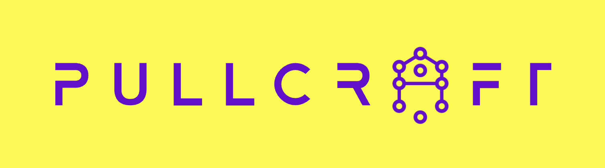

# PullCraft


[](https://badge.fury.io/js/pullcraft)
[](https://github.com/jamesvillarrubia/pullcraft/blob/main/LICENSE)
[](https://github.com/jamesvillarrubia/pullcraft/actions)
[](https://codecov.io/gh/jamesvillarrubia/pullcraft)
[](https://www.npmjs.com/package/pullcraft)
[]()
[](https://nodejs.org/en/)

PullCraft is a simple but powerful CLI tool for automating the creation and updating of GitHub pull requests. It creates diffs based on your code changes and a base or specified branch, then uses generative AI to create meaningful PR titles and descriptions.  It then creates the PR for you and opens the PR in the browser for final review.  You can provide hints, templates, and other options to customize the PR creation process to your needs.

## Table of Contents
- [Features](#features)
- [Prerequisites](#prerequisites)
- [Quick Start](#quick-start)
- [Installation](#installation)
- [Usage](#usage)
  - [CLI Examples](#cli-examples)
  - [Library Usage](#library-usage)
- [Configuration Options and CLI Flags](#configuration-options-and-cli-flags)
- [Template Placeholders](#template-placeholders)
- [Examples](#examples)
- [Troubleshooting](#troubleshooting)
- [Contributing](#contributing)
- [License](#license)
- [Acknowledgments](#acknowledgments)

## Features

- Automatic PR creation and updating
- AI-powered generation of PR titles and descriptions
- Customizable templates for PR content
- Support for different GitHub authentication strategies
- Configurable file exclusions and diff thresholds
- Option to dump diffs to a file for manual review

## Prerequisites
- Git
- A GitHub account
- An OpenAI API key

## Installation

### Option 1: Using npm (for Node.js users)

If you have Node.js installed, you can install PullCraft using npm:

```bash
npm install -g pullcraft
```
### Option 2: Direct download (for non-Node.js users)

1. Download the PullCraft executable:
   ```bash
   curl -LO https://github.com/jamesvillarrubia/pullcraft/releases/download/v0.4.0/pullcraft
   ```
   Note: Replace `v0.4.0` with the latest version number if necessary.

2. Make the downloaded file executable:
   ```bash
   chmod +x pullcraft
   ```

3. Move the executable to a directory in your PATH:
   ```bash
   sudo mv pullcraft /usr/local/bin/pullcraft
   ```

4. Verify the installation:
   ```bash
   pullcraft --version
   ```

For more detailed installation instructions, see our [Installation Guide](INSTALL.md).

## Quick Start

1. Set up your OpenAI API key:
   - Option 1: Create a `.env` file in your project root:
     ```bash
     OPENAI_API_KEY=your_api_key_here
     ```
   - Option 2: Set it as an environment variable in your shell:
     ```bash
     export OPENAI_API_KEY=your_api_key_here
     ```
   - Option 3: Use the `--api-key` option when running PullCraft:
     ```bash
     plc main feature-branch --api-key your_api_key_here
     ```

2. Create a PR:
   ```bash
   plc main feature-branch
   ```

## Usage

### CLI Examples

PullCraft is primarily used as a command-line tool. Here are some common usage scenarios:

1. Basic usage (create a PR from current branch to the default base branch):
   ```bash
   plc
   ```

2. Specify both base and compare branches:
   ```bash
   plc main feature-branch
   ```

// ... (keep the rest of the CLI examples) ...

### Library Usage

// ... (keep existing content) ...

// ... (keep the rest of the sections as they are) ...


## Quick Start

1. Install PullCraft:
   ```bash
   npm install -g pullcraft
   ```

2. Set up your OpenAI API key:
   - Option 1: Create a `.env` file in your project root:
     ```bash
     OPENAI_API_KEY=your_api_key_here
     ```
   - Option 2: Set it as an environment variable in your shell:
     ```bash
     export OPENAI_API_KEY=your_api_key_here
     ```
   - Option 3: Use the `--api-key` option when running PullCraft:
     ```bash
     pullcraft main feature-branch --api-key your_api_key_here
     ```

3. Create a PR:
   ```bash
   pullcraft main feature-branch
   ```

## Installation

```bash
npm install -g pullcraft
```

## Usage

### CLI Examples

PullCraft is primarily used as a command-line tool. Here are some common usage scenarios:

1. Basic usage (create a PR from current branch to the default base branch):
   ```bash
   pullcraft
   ```

2. Specify both base and compare branches:
   ```bash
   pullcraft main
   ```
3. Specify both base and compare branches:
   ```bash
   pullcraft main feature-branch
   ```

4. Use custom file exclusions:
   ```bash
   pullcraft main --exclusions "*.md,package-lock.json"
   ```

5. Open the PR in the browser after creation:
   ```bash
   pullcraft main --open-pr
   ```

6. Use a specific GitHub strategy:
   ```bash
   pullcraft main --github-strategy octokit
   ```

7. Provide a hint for the AI:
   ```bash
   pullcraft main --hint "This PR updates the user authentication system"
   ```

8. Use custom templates:
   ```bash
   pullcraft main --title-template "feat: {{title}}" --description-template "## Changes\n\n{{description}}"
   ```

9. Set a custom diff threshold:
   ```bash
   pullcraft main --diff-threshold 600
   ```

10. Use a different OpenAI model:
   ```bash
   pullcraft main --model gpt-4
   ```

11. Dump the diff to a file for review:
    ```bash
    pullcraft main --dumpTo diff.txt
    ```

12. Combine multiple options:
    ```bash
    pullcraft main feature-branch --open-pr --exclusions "*.md" --hint "Bug fix for login system" --diff-threshold 500
    ```

Remember, you can always use the `--help` option to see all available commands and options:

```bash
pullcraft --help
```

These examples showcase the flexibility of PullCraft's CLI. You can mix and match options to suit your specific needs and workflow.

### Library Usage

```javascript
import PullCraft from 'pullcraft';

const options = {
  // ... your configuration options
};

const pullCraft = new PullCraft(options);
pullCraft.createPr('main', 'feature-branch');
```

## Configuration Options and CLI Flags

PullCraft can be configured using a `.pullcraftrc` file, environment variables, or command-line options.  The config file is ingested via [cosmiconfig](https://github.com/davidtheclark/cosmiconfig), so it's location and format is quite flexible. The configuration is resolved in the following order:

1. Command-line options
2. Configuration file
3. Default values

Example `.pullcraftrc` file:

```json
{
  "baseDefault": "main",
  "openPr": true,
  "exclusions": [".md", "package-lock.json"],
  "githubStrategy": "gh"
}
```

PullCraft will look for the OpenAI API key in the following order:
1. Command-line option (`--api-key`)
2. Environment variable (`OPENAI_API_KEY`)
3. `.env` file in the project root
4. Configuration file (`.pullcraftrc`)

Always ensure your API key is kept secure and not exposed in public repositories.

| Option | Type | Default | CLI Flag | Alias | Description |
|--------|------|---------|----------|-------|-------------|
| `baseDefault` | string | `'main'` | `--base-branch <branch>` | `-b` | Default base branch for PR creation |
| `compareBranch` | string | - | `--compare-branch <branch>` | `-c` | Specify the compare branch |
| `openPr` | boolean | `false` | `--open-pr` | `-o` | Automatically open PR in browser after creation |
| `exclusions` | string[] | `[]` | `--exclusions <patterns>` | `-e` | File exclusion patterns (comma-separated) |
| `githubStrategy` | string | `'gh'` | `--github-strategy <strategy>` | `-g` | GitHub authentication strategy ('gh' or 'octokit') |
| `githubToken` | string | - | `--github-token <token>` | | GitHub token (required for 'octokit' strategy) |
| `placeholderPattern` | string | `'__KEY__'` | `--placeholder-pattern <pattern>` | `-p` | Pattern for placeholders in templates |
| `diffThreshold` | number | `400` | `--diff-threshold <number>` | `-d` | Maximum number of lines for diff display |
| `titleTemplate` | string | `'__title__'` | `--title-template <template>` | `-t` | Template for PR title |
| `descriptionTemplate` | string | `'__description__'` | `--description-template <template>` | `-d` | Template for PR description |
| `hint` | string | - | `--hint <text>` | `-h` | Hint for the AI about the type of changes |
| `dumpTo` | string | - | `--dump-to <filename>` | | Filename to dump the diff for manual review |
| `openaiConfig.apiKey` | string | - | `--api-key <key>` | | OpenAI API Key |
| `openaiConfig.url` | string | OpenAI's default | `--url <url>` | | Custom URL for OpenAI API |
| `openaiConfig.model` | string | `'gpt-3.5-turbo'` | `--model <model>` | `-m` | OpenAI model to use |
| `openaiConfig.maxTokens` | number | `500` | `--max-tokens <number>` | | Maximum number of tokens in the OpenAI response |
| `openaiConfig.n` | number | `1` | `--n <number>` | | Number of completions to generate for OpenAI |
| `openaiConfig.stop` | string | - | `--stop <sequence>` | | Stop sequence for OpenAI API |
| `openaiConfig.temperature` | number | `0.7` | `--temp <number>` | | Sampling temperature for OpenAI API |

Additional CLI-only flags:
- `--help`: Display help information
- `--version` (`-v`): Display version information
Example usage:

```bash
pullcraft main feature-branch --open-pr -e ".md,package-lock.json" -d 600 -m gpt-4 --temp 0.8 --hint "Refactoring authentication system"
```

This table provides a comprehensive list of all CLI options and flags, including their aliases (where applicable) and descriptions. It gives users a quick reference for all available command-line arguments they can use with PullCraft.

## Template Placeholders

PullCraft uses a placeholder system in its title and body templates to dynamically insert information from the git repository and the diff. The default placeholder pattern is `__KEY__`, where `KEY` is replaced with the actual placeholder name.

### Available Default Placeholders

- `__owner__`: The owner of the repository
- `__repo__`: The name of the repository
- `__baseBranch__`: The base branch of the pull request
- `__compareBranch__`: The compare branch of the pull request

### Using Placeholders in Templates

You can use these placeholders in your title and body templates. For example, the title template: is
```javascript
export const titleTemplate = '<:build,chore,ci,docs,feat,fix,perf,refactor,style,test>: <TITLE GOES HERE>\n Example: "fix: Adds a missing semicolon"';
```
But this can be overridden by the command line option.  For example, you can use:
```bash
pullcraft main --title-template '__baseBranch__ -> __compareBranch__ : <TITLE GOES HERE>\n Example: "main -> ci/add-colon : Adds a missing semicolon"';
```

In this example:
- `__compareBranch__` and `__baseBranch__` will be replaced with the actual branch names
- `<TITLE GOES HERE>` is simply instructions for the AI on where to put the title and is not a strict placeholder.

### Custom Placeholders

You can also define custom placeholders in your configuration or command line options. These will be available for use in your templates and will be filled by the AI-generated content.

### Changing the Placeholder Pattern

If you prefer a different placeholder pattern, you can change it using the `--placeholder-pattern` option:

```bash
bash
pullcraft main --placeholder-pattern "{{KEY}}" --title-template "feat({{repo}}): {{KEY_FEATURE}}"
```

This will use `{{KEY}}` as the placeholder pattern instead of `__KEY__`. This flexibility allows you to customize the templates to fit your project's conventions and needs.

## Examples

Here are some examples of how to use PullCraft with various options and scenarios:

1. Basic usage:
   ```bash
   pullcraft main
   ```

2. Specify both base and compare branches:
   ```bash
   pullcraft main feature-branch
   ```

3. Use custom file exclusions:
   ```bash
   pullcraft main --exclusions "*.md,package-lock.json"
   ```

4. Open the PR in the browser after creation:
   ```bash
   pullcraft main --open-pr
   ```

5. Use a specific GitHub strategy:
   ```bash
   pullcraft main --github-strategy octokit
   ```

6. Provide a hint for the AI:
   ```bash
   pullcraft main --hint "This PR updates the user authentication system"
   ```

7. Use custom templates:
   ```bash
   pullcraft main --description-template "## Changes\n\n{{description}}"
   ```

8. Set a custom diff threshold:
   ```bash
   pullcraft main --diff-threshold 600
   ```

9. Use a different OpenAI model:
   ```bash
   pullcraft main --model gpt-4
   ```

10. Dump the diff to a file for review:
    ```bash
    pullcraft main --dumpTo diff.txt
    ```

11. Combine multiple options:
    ```bash
    pullcraft main feature-branch --open-pr --exclusions "*.md" --hint "Bug fix for login system" --diff-threshold 500
    ```

These examples demonstrate various use cases and options that PullCraft supports.

## Troubleshooting

If you encounter issues while using PullCraft, try the following:
1. Ensure your OpenAI API key is correctly set and has sufficient credits.
2. Check that you have the necessary permissions for the GitHub repository you're working with.
3. Verify that your local Git repository is up to date with the remote.
4. If using the 'gh' strategy, ensure you're logged in with the GitHub CLI (`gh auth login`).

For more detailed troubleshooting, please check our [FAQ](https://github.com/pullcraft/wiki/FAQ) or [open an issue](https://github.com/jamesvillarrubia/pullcraft/issues) on GitHub.

## Contributing

Please see [CONTRIBUTING.md](https://github.com/jamesvillarrubia/pullcraft/blob/main/CONTRIBUTING.md) for details on our code of conduct and the process for submitting pull requests.

## License

This project is licensed under the MIT License - see the [LICENSE](https://github.com/jamesvillarrubia/pullcraft/blob/main/LICENSE) file for details.

## Acknowledgments

- OpenAI for providing the AI capabilities
- The GitHub CLI and Octokit teams for their excellent APIs